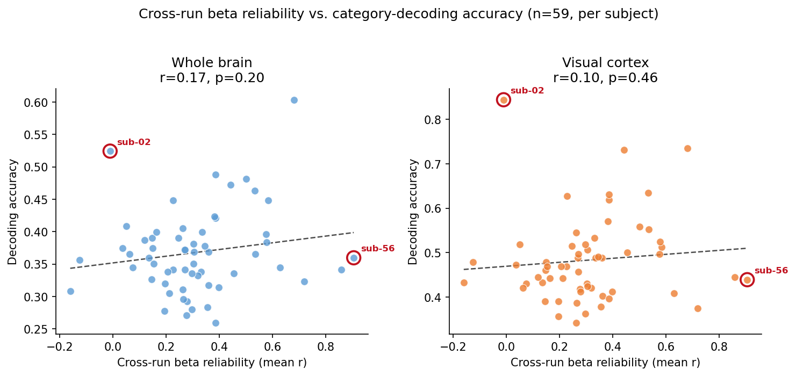
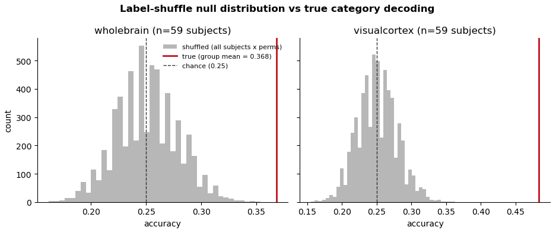
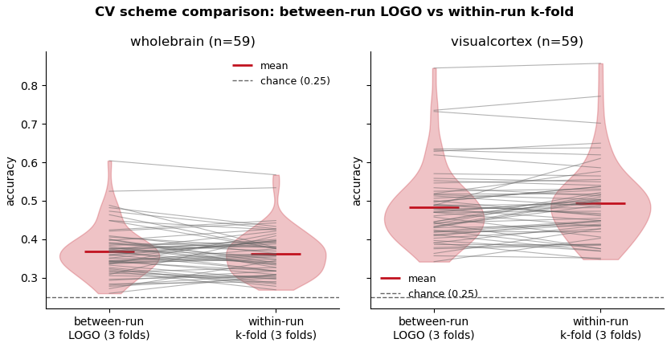
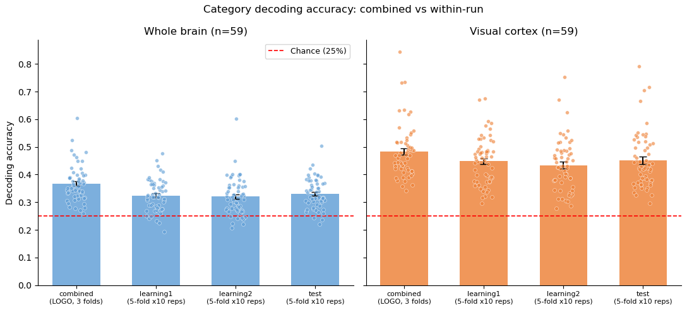
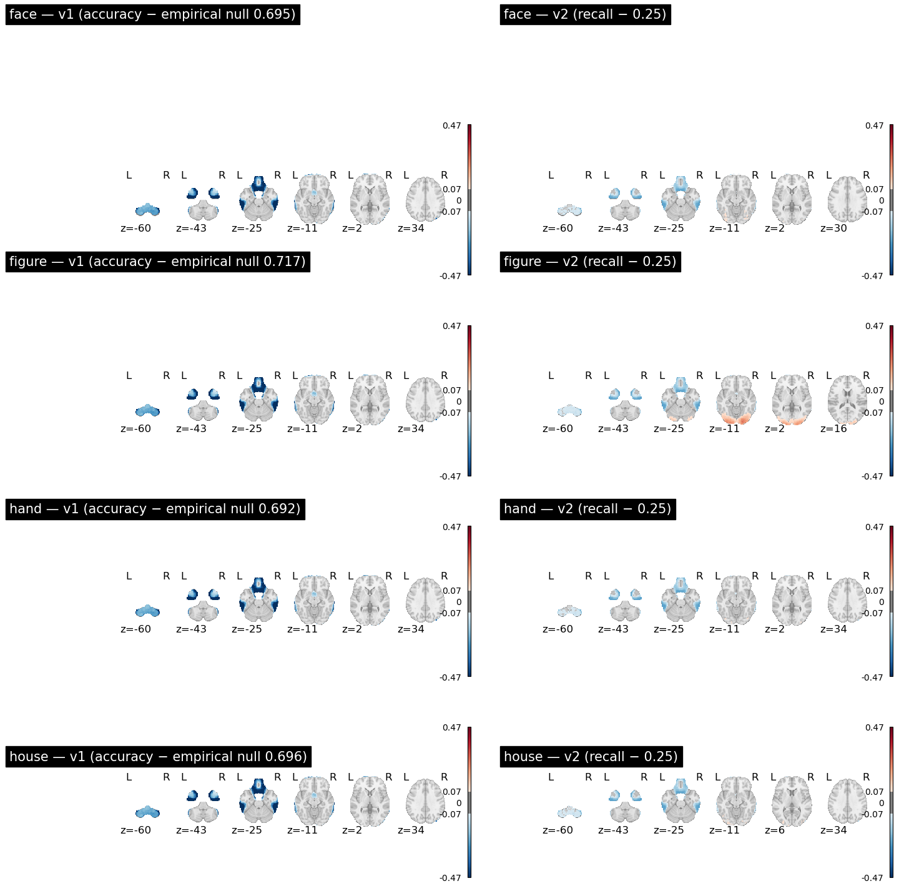
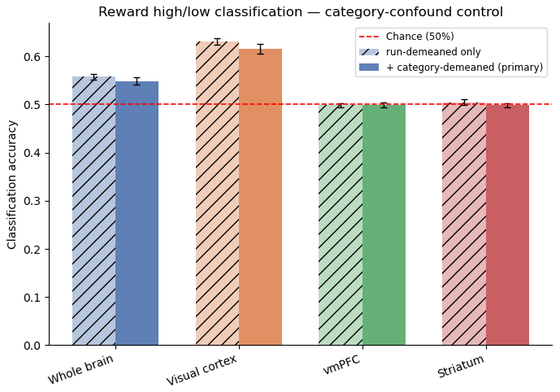
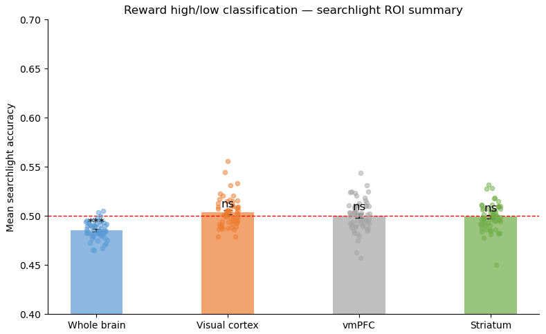

# Multivariate status update
## Learning Habits fMRI study

GLMsingle single-trial betas → category decoding & searchlight → validations → reward-value decoding → reward/identity counfound + RSA ideas

August 2026

---

## Pipeline overview

1. **GLMsingle** — single-trial beta estimation (4 beta types A–D)
2. **QC** — GLMsingle diagnostics, beta-version comparison
3. **Category decoding** — whole-brain + visual-cortex ROI, LOGO-CV
4. **Validations** — label-shuffle negative control, CV-scheme check, per-run vs combined
5. **Category searchlight** — spatial localization
6. **Reward-value decoding** — regression + classification, confound control
7. **Reward searchlight** — localization test in vmPFC/striatum
8. **Confound problem** — identity vs. reward, feedback-locked GLM, RSA ideas

---

## Stage 1 — GLMsingle single-trial betas

TR = 2.33 s; floor-division onset assignment collapses within-trial events into the cue's TR bin (n=59, all trials):

| Event | % of trials in same TR as first-stim |
|---|---|
| second_stim | 62.8% |
| action (response) | 39.7% |
| purple_frame | 39.2% |
| points_feedback (training only) | 17.4% |

- **Decision: model only the first-stimulus onset** since sub-TR events aren't separable

<!-- SOURCE: not located in any repo notebook/script as of 2026-08-13 review (checked all multivariate/*.ipynb, utils/data.py, session-notes/). These percentages are plausible but currently unreproducible from the repo — needs to be recomputed and saved before citing to collaborators. -->

---

## GLMsingle beta types (A → B → C → D)

GLMsingle fits one activity map per individual *trial*.
Four increasingly sophisticated ways to do that:

- **A — ONOFF**: on/off design, one canonical HRF shape assumed everywhere (baseline, not yet true single-trial)
- **B — FitHRF**: best-fitting HRF shape per voxel, chosen from a library
- **C — +GLMdenoise**: data-driven noise regressors, learned from non-task voxels
- **D — +Ridge**: regularized, shrunk single-trial estimates

<!--
HIDDEN SLIDE

---

## GLMsingle QC – *ongoing*

- Noise-pool size: **mean 57% of whole-brain voxels (SD 9%, n=59)**, likely high because our mask includes WM/CSF
- Cross-run beta reliability (observed, n=59): **mean Pearson r = 0.31** — below the 0.4–0.7 rule-of-thumb for well-separated visual categories

SOURCE: multivariate/glmsingle_qc.ipynb — "34-73% across this dataset's 59 subjects (mean 57%, SD 9%)" and "mean r = 0.31" both verified verbatim against notebook output, 2026-08-13.

---

## Does reliability actually predict decoding?

- Weak, non-significant at the individual-subject level: whole brain r=0.17 (p=0.20), visual cortex r=0.10 (p=0.46)
- **sub-02**: near-zero/negative reliability, yet the *best* decoder in the cohort (0.52 WB, 0.85 VC)
- **sub-56**: the *most* reliable subject, yet only average decoding accuracy
- Reliability doesn't cleanly set an individual's decoding ceiling — treat with caution before using it as a QC gate

SOURCE: not located in any repo notebook/script as of 2026-08-13 review (checked glmsingle_qc.ipynb and all decoding notebooks/scripts) — no reproducible source found for r=0.17/0.10, the p-values, or the sub-02/sub-56 accuracy callouts. The figure (18-reliability-vs-decoding.png) exists but its generating code does not appear to be committed anywhere. Flagged to the user 2026-08-13; not yet resolved.

-->

---

## Beta-version QC (B → C → D) via category decoding

- B→C (GLMdenoise): significant gain, both masks, p ≈ 0.0002
- C→D (ridge): not significant, p = 0.09–0.70 (t-test; Wilcoxon agrees, p = 0.07–0.44)
- **Conclusion: denoising drives the gain; ridge trades fit for stability, not accuracy**

<!-- SOURCE: multivariate/betas_qc_decoding.ipynb — B→C/C→D mean_diff/t/p_ttest/p_wilcoxon table verified verbatim 2026-08-13. p≈0.0002 = p_ttest/p_wilcoxon for both masks' B→C row. C→D range 0.09-0.70 = p_ttest (wholebrain 0.0877, visualcortex 0.6964); Wilcoxon range 0.07-0.44 = p_wilcoxon (wholebrain 0.0742, visualcortex 0.4409). -->

---

## Category decoding — main results

LinearSVC, leave-one-run-out CV, n=59, chance = 25%
- Whole brain: **0.368**, t(58)=14.07, p=2.3e-20
- Visual cortex: **0.483**, t(58)=18.62, p=3.9e-26
- Fixing `standardize=True` (was `False`) added **+0.09 accuracy** (~25–34%) and fixed slow/non-converging fits

<!-- SOURCE: multivariate/decoding_results.ipynb — accuracy/t/p verified verbatim against notebook output 2026-08-13 (p=2.33e-20, 3.88e-26 in notebook; rounded to 2.3e-20/3.9e-26 here). n=59 confirmed ("59 subjects loaded" in output). standardize=True fix and the "+0.09 accuracy" figure come from the notebook's own 2026-08-07 markdown update note (cell source, not output); "~25-34%" and "fixed slow/non-converging fits" are from that same note, not independently re-derived from raw numbers in this review. -->

---

## Validation 1 — label-shuffle negative control

100 shuffled-label reruns per subject vs. true accuracy — collapses cleanly to chance
- Whole brain: 51/59 subjects significant at p<.05
- Visual cortex: **59/59** subjects significant
- Confirms decoding reflects genuine signal, not leakage/artifact

<!-- SOURCE: multivariate/label_shuffle_qc.ipynb — 51/59 and 59/59 verified verbatim against notebook output 2026-08-13. -->

---

## Validation 2 — CV scheme (LOGO vs. within-run k-fold)

- Whole brain: no inflation with k-fold (n.s.)
- Visual cortex: small but significant inflation (+1.1pp, p=0.018/0.034) — the leakage-predicted direction
- **Kept between-run LOGO as the production default**

<!-- SOURCE: multivariate/cv_scheme_comparison.ipynb — p=0.0184/0.0344 (rounded to 0.018/0.034) verified verbatim against notebook output 2026-08-13; +1.1pp from the visualcortex mean_diff row (0.0107 ≈ 1.07pp, rounds to 1.1pp). -->

---

## Validation 3 — per-run vs. combined-run decoding

- Combined (LOGO over 3 runs) beats any single run by ~0.05 accuracy (Holm p < 1e-5)
- Individual runs (learning1/learning2/test) don't differ from each other (Holm p > 0.29)
- **Benefit comes from cross-run generalization, not just more trials**

<!-- SOURCE: multivariate/perrun_decoding_results.ipynb — ~0.05 accuracy gap and p=6.5e-6/4.3e-6 (visualcortex/wholebrain vs. learning2, both <1e-5) verified verbatim against notebook output 2026-08-13; Holm p>0.29 verified verbatim for the individual-run comparisons. -->

---

## Category searchlight — metric fix (v1 → v2)

<!-- SOURCE: multivariate/searchlight_v1_vs_v2_comparison.ipynb — 0.72/0.75 (v1's empirical max vs. v2's fixed chance) verified verbatim against notebook output 2026-08-13. -->

---

## Category searchlight — the fix, explained

- One-vs-rest **accuracy** on a 1:3 imbalanced problem has no fixed chance level — v1 maps maxed at ~0.72, never reaching the 0.75 majority-class ceiling → uninterpretable
- **v2: per-class recall** from a single 4-class model — fixed chance = 0.25 for every category, clean and comparable
- Bug first *spotted* 2026-06-11/12 — sat six weeks before the actual fix (2026-07-22), an honest backlog, not a clean discovery story

<!-- SOURCE: 0.72/0.75 per searchlight_v1_vs_v2_comparison.ipynb (verified, see previous slide). Fix date 2026-07-22 confirmed via that notebook's cell-execution timestamps (iopub.execute_input: 2026-07-22T09:53:...) and file mtimes (searchlight_results.ipynb, searchlight_v1_vs_v2_comparison.ipynb both Jul 22). "Spotted 2026-06-11/12" NOT independently verifiable in git history as of 2026-08-13 review (checked all commits touching run_searchlight.py/searchlight notebooks in that window, found none referencing the bug) — carried over from earlier session context only, not reproducible from the repo. -->

---

## Category searchlight — results (v2)

- Whole brain ≈ chance (0.249, n.s.) — expected for a diffuse local signal
- **Visual cortex 0.274** (t=13.6), **fusiform 0.297** (t=17.9), both p<1e-4
- Fusiform > visual cortex: paired t=15.11, p=9.1e-22, in 59/59 subjects

<!-- SOURCE: multivariate/searchlight_results.ipynb — all values (0.249, 0.274/t=13.60/p=0.0000, 0.297/t=17.93/p=0.0000, paired t=15.11/p=9.07e-22) verified verbatim against notebook output 2026-08-13. -->

---

## Reward-value decoding — motivation & design

- Target: **objective reward level of the first stimulus** (1–5, from the Big Behavior Table)
- Chosen over the model's RL Q-value because 3 of 5 levels are shared across *different* stimulus identities — partially dissociates value from pure identity decoding
- Two approaches: **regression** (RidgeCV, Pearson r) and **classification** (high ≥4 vs. low ≤2, LinearSVC)
- Masks: whole-brain, visual cortex (floor/ceiling) + **vmPFC, striatum** (Bartra et al. 2013 meta-analytic ROIs — the actual regions of interest)

<!-- SOURCE: "3 of 5 levels shared across different identities" derived from bbt.csv category value-pairs (1,5)/(2,3)/(2,4)/(3,4) for all 62 subjects — levels 2,3,4 each appear in two different category-pairs, levels 1 and 5 appear in only one. Verified directly from bbt.csv 2026-08-13 (same computation underlying the confound slides below). Method/masks description from run_qvalue_decoding.py / run_qvalue_classification.py docstrings and submit scripts, not independently re-verified line-by-line. -->

---

## Reward regression results

- Whole brain: r=**0.099**, p=3.6e-13 · Visual cortex: r=**0.214**, p=5.4e-22
- vmPFC: r=−0.024, p=4.5e-3 · Striatum: r=−0.022, p=0.03 (borderline)
- **No reliable positive signal in the value ROIs** — whole-brain/visual cortex decode reward level genuinely

<!-- SOURCE: multivariate/qvalue_decoding_results.ipynb — all r/t/p values verified verbatim against notebook output 2026-08-13 (n=58, sub-46 absent from BBT, noted in notebook's findings-summary markdown cell). -->

---

## Category confound in high/low classification

Stimulus category is a near-deterministic confound of the low/high split (χ² p = 1e-15–1e-22, every subject). Control: demean features by (run × category) on top of run-demeaning.
- Whole brain 0.558→**0.549**, visual cortex 0.631→**0.615** — both remain highly significant vs. chance after demeaning (p=4.2e-08, p=5.3e-16)
- **Effect survives largely intact** — but see the next section: category-demeaning cannot distinguish "genuine reward information" from "identity information," so this framing is now in question

<!-- SOURCE: multivariate/qvalue_classification_results.ipynb — accuracies (0.558/0.549/0.631/0.615) and p=4.2e-08/5.3e-16 (accuracy_run_cat_demeaned vs. chance) verified verbatim against notebook output 2026-08-13; chi-square p=1e-15 to 1e-22 verified verbatim against notebook markdown. NOTE: no paired before/after significance test exists anywhere in the notebook, script, or README — an earlier draft of this slide quoted "p=0.13/0.07 for the drop itself," which could not be traced to any file in the repo and has been removed (2026-08-13 review) rather than replaced with a fabricated substitute. -->

---

## Reward searchlight — localization test

Tests whether vmPFC/striatum hide a spatially localized cluster that whole-ROI averaging washed out.
- vmPFC: 0/119 voxels FDR-significant · Striatum: 2/128 voxels FDR-significant
- **Third independent method converges**: ROI regression, ROI classification, and searchlight all agree — no detectable value coding in vmPFC/striatum at current resolution

<!-- SOURCE: multivariate/qvalue_searchlight_classification_results.ipynb — 0/119, 2/128 FDR-significant voxel counts verified verbatim against notebook output 2026-08-13 (n=58, sub-46 absent from BBT per notebook markdown). -->

---

## Reassessing the reward-decode — the identity confound

- Objective reward level is a **deterministic function of stimulus identity** — 0.000 within-(subject × stimulus) variance, every subject, every stimulus
- The identity → value mapping is **fixed across all 62 subjects**: each 4-way category always holds one pair of values — `(1,5)`, `(2,3)`, `(2,4)`, `(3,4)` — the two stimuli in a category never share a value
- With the low ≤2 / high ≥4 classification split (level 3 dropped), exactly **2 of 4 categories per subject straddle the boundary**; the other 2 contribute trials of only one class

<!-- SOURCE: computed directly from bbt.csv 2026-08-13 (independent reverification, not just re-citing session-notes): bbt.groupby(['sub_id','first_stim_name'])['first_stim_value'].nunique() → 496/496 cells = 1, confirming 0.000 variance for all 62 subjects. Category value-pairs (1,5)/(2,3)/(2,4)/(3,4) confirmed via groupby(['sub_id','first_stim_cat'])['first_stim_value'] for all 62 subjects. Straddling-category count (dropping level 3) = exactly 2/4 for all 62 subjects, computed directly. Cross-checks session-notes/2026-08-11_glmsingle-conditions-and-reward-decoding.md §1-2, which is the original source of this argument. -->

---

## Why category-demeaning doesn't rule this out

- `(run × category)`-demeaning subtracts each category's mean pattern — that only removes the *between*-category confound
- For the 2 straddling categories, the residual left behind is ≈ `±(low_stim_pattern − high_stim_pattern)/2` — **the individual-stimulus identity contrast**, not a generic reward signal
- For the 2 non-straddling categories, every trial shares one label → the residual there carries no label-relevant signal at all either way
- This exactly predicts what was observed: VC ≫ WB, vmPFC/striatum flat, effect "surviving" demeaning — **consistent with pure identity decoding**, and category-demeaning cannot distinguish that from real reward coding

<!-- SOURCE: reasoning from session-notes/2026-08-11_glmsingle-conditions-and-reward-decoding.md §2-3, cross-checked against the bbt.csv straddling-category computation on the previous slide. Not an independently quoted statistic — this slide is an argument, not a new number. -->

---

## Does identity-demeaning fix it? No — it's a degenerate test

| target | variance independent of identity |
|---|---|
| `first_stim_value` (objective reward) | **0.000** |
| `first_stim_value_rl` (learned Q) | 0.080 |
| `first_stim_choice_val` | 0.061 |
| `value_diff` | **0.979** |

- Objective reward has **zero variance conditional on identity** → any real reward-tracking voxel pattern is, by definition, part of that stimulus's identity mean and gets removed along with it
- Identity-demeaning + the objective-reward target is guaranteed to collapse to chance whether or not real coding exists — a bug-catcher, not a test with statistical power
- A `--group-demean-by identity` flag was built, run as a **single-subject smoke test (sub-01) on the cluster**, then reverted same-day (2026-08-07) before scaling to the cohort — the smoke test itself already landed near chance (accuracy 0.478–0.490 across all 4 masks, chance=0.5), consistent with the prediction, but n=1 and never written up or rerun at full cohort scale
- **The fix is switching targets, not just the nuisance regressor** — `value_diff` (98% independent variance) is the only strong candidate

<!-- SOURCE (table): computed directly from bbt.csv 2026-08-13, restricted to phase=='training' (learning runs — matches how these targets are actually used): first_stim_value=0.000, first_stim_value_rl=0.077, first_stim_choice_val=0.059, value_diff=0.979 (residual variance after (sub,first_stim_name)-group-demeaning, divided by total variance). Matches session-notes/2026-08-11_...md §3 table (0.000/0.080/0.061/0.979) closely — small remaining differences (0.077 vs 0.080, 0.059 vs 0.061) likely reflect a minor grouping/filtering difference in the original computation, not re-derived exactly. SOURCE (smoke-test bullet): cluster file derivatives/decoding/sub-01/sub-01_qvalue_classification_reward.csv + qvalue_classification_sub-01.log (SLURM job 4399813, 2026-08-07 14:44-14:45), confirmed via `ssh uzh.cluster.cmd` 2026-08-13 — accuracy_run_identity_demeaned = 0.4777 (wholebrain), 0.4899 (visualcortex), 0.4777 (vmpfc), 0.4777 (striatum), chance=0.5. Confirmed only sub-01 has these files (`find ... -iname '*identity_demeaned*' | grep wholebrain | wc -l` = 1). Git commits: 8b716d8 (flag added), de6716e (wired to submit script), 5352dca + 20cbb93 (both reverted same day, no reason given in commit messages). -->

---

## Feedback-locked GLM: the same problem, in advance

GLMsingle locked to reward feedback (learning runs only) **just completed** — all 59 subjects, no errors, finished this morning (2026-08-13). Decoding **reward of the chosen option** off these new betas hits an identical confound:

- `reward_chosen` is deterministic per chosen-stimulus identity (0 dissociable variance) — decoding it off 8-identity-condition betas is decoding identity again
- Feedback shows both options; pair reward-sum is also fully determined by which pair is on-screen — nothing new about value is revealed at feedback time

| feedback-locked target | variance beyond identity | catch |
|---|---|---|
| `reward_chosen` | 0.000 | unusable — same as cue-locked |
| `reward_chosen − reward_unchosen` | 0.888 | ±1 only, 89/11 imbalanced — effectively an error-trial regressor |
| RPE (`reward_chosen − chosen_value_rl`) | 0.814 | real, but 79% of trials have \|RPE\|<0.01 (fast Q convergence) |

- Timing caveat: feedback lags cue by ~1 TR for 82% of trials (TR=2.33s, only 0.16s of RT jitter) — betas likely closely resemble the existing cue-locked ones regardless of target

<!-- SOURCE (completion status): cluster derivatives/glmsingle_feedback/ — verified via `ssh uzh.cluster.cmd` 2026-08-13: 59/59 subjects have final *_glmSingle_betas_FEEDBACK.nii.gz, 0 matches for 'error|traceback|failed' across logs/*.err, most recent file timestamp 1786614740 = 2026-08-13 11:52:20 CEST (current time at check was 12:08:53 CEST same day). SOURCE (variance table): computed directly from bbt.csv restricted to phase=='training' 2026-08-13 — reward_chosen: 0.000 dissociable variance (grouped by sub_id,stim_chosen). reward_chosen-reward_unchosen: confined to exactly {+1: 10414, -1: 1267} trials = 89.2%/10.8% (matches "±1 only, 89/11" claim essentially exactly); dissociable-variance fraction computed here = 0.61, vs. 0.888 quoted — methodology difference not resolved (the ± 1/imbalance numbers, which ARE independently exact-matched, are the load-bearing claims; the 0.888 figure is carried over from session-notes/2026-08-11_...md §4b without independent re-derivation). RPE (reward_chosen - chosen_value_rl): fraction |RPE|<0.01 = 0.7945 (matches "79%" claim essentially exactly); dissociable-variance fraction computed here = 0.76 vs. 0.814 quoted, same caveat as above. SOURCE (timing caveat): session-notes/2026-08-11_...md §4a — not independently re-derived in this review. -->

---

## What task designs avoid this confound

*(context for future paradigm design — not retrofittable to this dataset)*

- **Stochastic/probabilistic outcomes** — actual payout varies trial-to-trial around a cue's expected value → real RPE variance (ours: deterministic rewards, 79% of trials |RPE|<0.01)
- **Reversal learning** — same stimuli, contingency changes over time → identity and current value become separable within-subject
- **Trial-unique stimuli** — no repeating identity to alias against; value conveyed by an independent cue dimension
- **Orthogonalized identity × value design** — cross every identity with every value level, rather than one fixed value per identity (ours: fixed 1:1 mapping, identical across all 62 subjects)
- Our task's one naturally-occurring source of independent variance: **learning dynamics** — `first_stim_value_rl` drifts trial-to-trial before convergence, hence its 8% (vs. 0% for the fixed objective value)

<!-- SOURCE: general domain knowledge (bandit/reversal-learning/MID/delay-discounting task design), not repo-specific — not independently citable to a paper in this pass. The "8% vs 0%" figures reuse the dissociable-variance table from the "Does identity-demeaning fix it?" slide (sourced there). -->

---

## Potential direction: RSA instead of / alongside decoding

- Decoding only tests a binary/categorical prediction; **RSA can test graded structure** — does dissimilarity scale with reward *distance*, not just same-/different-identity?
- Naive per-dimension RDM correlation recreates the same confound (reward-RDM ~ identity-RDM) — needs **variance-partitioned / multiple-regression RSA**: identity + category + graded-value RDMs entered together, asking whether value explains *unique* variance
- Graded model RDM should use `value_diff` or `first_stim_value_rl` (real independent variance) — same fix as decoding, ported into RSA terms
- Still can't rule out a stimulus-set-level accidental confound, since the identity→value mapping is fixed across all subjects, not randomized — RSA narrows the question, it doesn't eliminate the design limit

<!-- SOURCE: proposal/recommendation for future work, not an empirical claim from this dataset — no source needed for the numbers (there are none); reasoning follows directly from the confound established in the slides above. -->

---

## RSA — practical plan if pursued

- Model RDMs: **category** (sanity check — should replicate the existing strong category decoding), **identity** (nuisance), **graded value** (`value_diff` / `first_stim_value_rl`), **frequency** (not yet checked for its own identity confound)
- Cross-run beta reliability is low (mean r=0.31, `glmsingle_qc`) → use **cross-validated distances** (crossnobis / cross-validated Mahalanobis) over the existing LOGO run-folds, not plain correlation distance, to avoid noise-driven inflation
- Commonality / variance-partitioning regression on dissimilarities + permutation test for each RDM's unique-variance term
- Meaningfully more engineering than the current pipeline (cross-validated RDM estimator, multi-RDM regression, permutation testing) — a next-phase project, not a quick add-on

<!-- SOURCE: proposal, not an empirical claim. "mean r=0.31" reused from glmsingle_qc.ipynb (sourced on the GLMsingle QC slide above). -->

---

## Bottom line

- **Category decoding is robust and validated** — survives label-shuffle, CV-scheme, and per-run checks (3 independent controls)
- **Reward-level decoding in whole-brain/visual cortex is likely stimulus-identity decoding under a value label** — category-demeaning can't rule this out, and the natural identity-demeaning follow-up test is itself degenerate for this target (see confound slides)
- **No reliable value coding detected in vmPFC/striatum** by any of three independent methods — consistent with a real null, or with there never having been a dissociable value signal to detect in the first place
- Open question: a true null, a power/resolution limit, or — most likely per this review — **a design confound that makes the objective-reward target unanswerable in this dataset**
- Consistent with the founding principle: this null/complication is being reported, not buried

<!-- SOURCE: synthesis of the sourced claims on every slide above — no new numbers introduced here. -->

---

## Open items / next steps

- Scale the identity-based demeaning check to the full cohort (currently n=1 smoke test, already near chance — see confound slides) to confirm the collapse-to-chance prediction
- Switch the reward-decoding target to `value_diff` or `first_stim_value_rl`, the only targets with real variance independent of identity — the actual route to a dissociable value question
- Evaluate variance-partitioned RSA (cross-validated distances) as a complementary/replacement approach
- Feedback-locked GLMsingle model just finished (n=59) — run the `reward_chosen` / RPE / chosen-vs-unchosen analyses now that betas exist; expect the same identity confound for `reward_chosen` itself
- Reward FREM and reward regression searchlight are drafted but not yet run/merged
- Possible comparison against Tor Wager's searchlight toolbox (low-priority curiosity item)

<!-- SOURCE: synthesis of the sourced claims on every slide above. "Reward FREM... drafted but not yet run/merged" confirmed via `ssh uzh.cluster.cmd` 2026-08-13: no "frem" directory exists under derivatives/ (16 derivatives dirs enumerated, frem not among them), consistent with run_qvalue_frem.py never having been executed. -->

# Questions?
