# Multivariate status update
## Learning Habits fMRI study

GLMsingle → category decoding → validations → reward confound → **RSA** → **frequency decoding & searchlight** → **RSA searchlight**

August 31, 2026

---

## Pipeline overview

1. **GLMsingle** — single-trial beta estimation (4 beta types A–D)
2. **QC** — GLMsingle diagnostics, beta-version comparison
3. **Category decoding** — whole-brain + visual-cortex ROI, LOGO-CV
4. **Validations** — label-shuffle, CV-scheme, per-run vs combined
5. **Category searchlight** — spatial localization
6. **Reward-value decoding** — regression + classification, confound control
7. **Confound problem** — identity vs. reward, cue/feedback redundancy
8. **RSA** — frequency vs. value coding, confound controls, interaction
9. **Frequency decoding** — ROI classification (±1 frequency label)
10. **Frequency searchlight** — voxel-level localization
11. **RSA searchlight** — whole-brain regression + interaction

---

## Stage 1 — GLMsingle single-trial betas

TR = 2.33 s; floor-division onset assignment collapses within-trial events into the cue's TR bin (n=59, all trials):

| Event | % of trials in same TR as first-stim |
|---|---|
| second_stim | 62.8% |
| action (response) | 39.7% |
| purple_frame | 39.2% |
| points_feedback (training only) | 17.4% |

- **Decision: model only the first-stimulus onset** since sub-TR events aren't separable

---

## GLMsingle beta types (A → B → C → D)

GLMsingle fits one activity map per individual *trial*.
Four increasingly sophisticated ways to do that:

- **A — ONOFF**: on/off design, one canonical HRF shape assumed everywhere (baseline)
- **B — FitHRF**: best-fitting HRF shape per voxel, chosen from a library
- **C — +GLMdenoise**: data-driven noise regressors, learned from non-task voxels
- **D — +Ridge**: regularized, shrunk single-trial estimates

---

## Beta-version QC (B → C → D) via category decoding

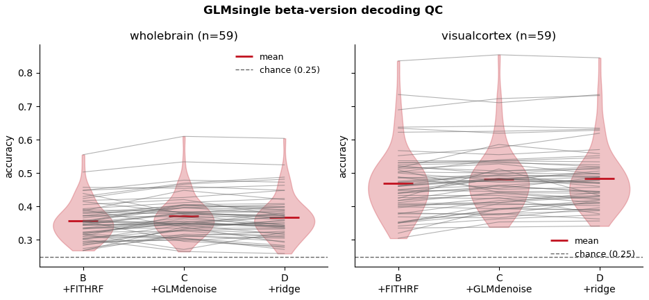

- B→C (GLMdenoise): significant gain, both masks, p ≈ 0.0002
- C→D (ridge): not significant, p = 0.09–0.70
- **Conclusion: denoising drives the gain; ridge trades fit for stability, not accuracy**

<!-- SOURCE: multivariate/betas_qc_decoding.ipynb — verified 2026-08-13. -->

---

## Category decoding — main results

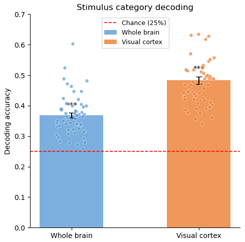

LinearSVC, leave-one-run-out CV, n=59, chance = 25%
- Whole brain: **0.368**, t(58)=14.07, p=2.3e-20
- Visual cortex: **0.483**, t(58)=18.62, p=3.9e-26

<!-- SOURCE: multivariate/decoding_results.ipynb — verified 2026-08-13. -->

---

## Validations — all passed

Three controls confirm category decoding reflects genuine signal:

1. **Label-shuffle** (100 permutations/subject): collapses to chance; 59/59 subjects significant in VC
2. **CV scheme** (LOGO vs. within-run k-fold): small inflation in VC (+1.1pp, p=0.018) — kept LOGO as production default
3. **Per-run vs. combined**: combined beats any single run by ~0.05 accuracy (Holm p<1e-5); individual runs don't differ from each other

<!-- SOURCE: multivariate/label_shuffle_qc.ipynb, cv_scheme_comparison.ipynb, perrun_decoding_results.ipynb — all verified 2026-08-13. -->

<!--
SPEAKER NOTES:
- Label-shuffle: WB 51/59 at p<.05, VC 59/59
- CV scheme: WB no inflation (n.s.), VC +1.07pp p=0.018/0.034 — leakage-predicted direction
- Per-run: learning1/2/test don't differ (Holm p>0.29); combined benefit from cross-run generalization
-->

---

## Category searchlight — results

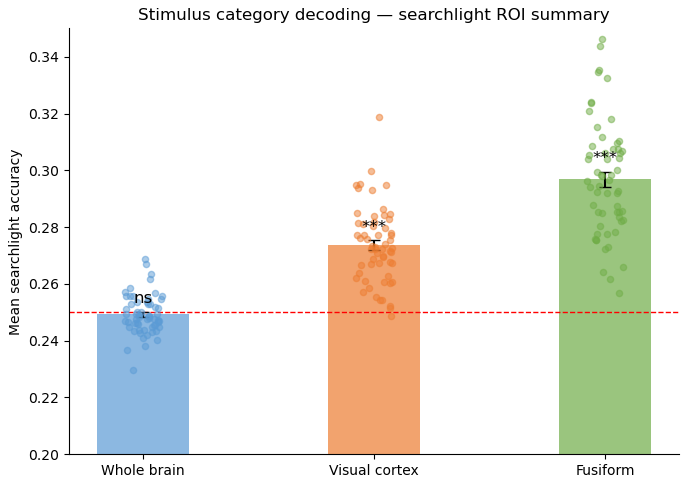

- Whole brain ≈ chance (0.249, n.s.) — expected for a diffuse local signal
- **Visual cortex 0.274** (t=13.6), **fusiform 0.297** (t=17.9), both p<1e-4
- Fusiform > visual cortex: paired t=15.11, p=9.1e-22, in 59/59 subjects

<!-- SOURCE: multivariate/searchlight_results.ipynb — verified 2026-08-13. -->

---

## Interim summary — category decoding

- **Category decoding is robust and validated** — 48.3% in VC (chance=25%), survives all controls
- Fusiform is the peak (29.7% mean searchlight recall), exceeds VC in every subject
- **Now: reward value?**

---

## Reward decoding + identity confound

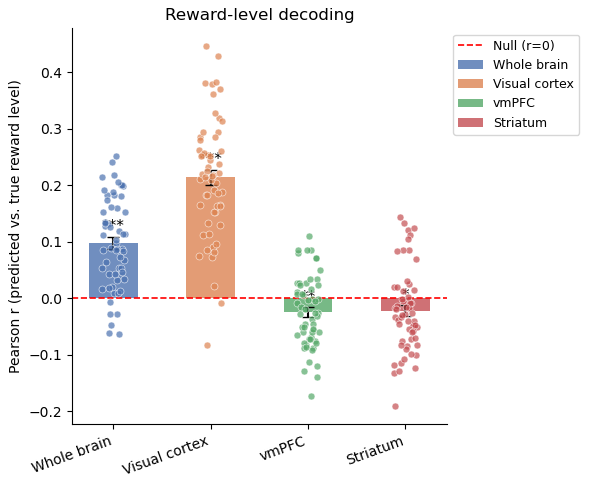

- WB r=0.099***, VC r=0.214*** — but **no signal in value ROIs** (vmPFC r=−0.024, striatum r=−0.022)
- Category confound: reward is a **deterministic function of stimulus identity** (0.000 within-subject variance)
- Category-demeaning can't separate value from identity — VC ≫ WB consistent with pure identity decoding

<!-- SOURCE: multivariate/qvalue_decoding_results.ipynb, qvalue_classification_results.ipynb — verified 2026-08-13. -->

<!--
SPEAKER NOTES:
- Classification (high≥4 vs low≤2): WB 0.558, VC 0.631; after run×cat demeaning: 0.549, 0.615 — both still significant
- χ² p=1e-15 to 1e-22 for category×label association (every subject)
- 2/4 categories straddle the high/low boundary; residual after demeaning ≈ ±(low_pattern − high_pattern)/2 = individual identity contrast
- Identity-demeaning is degenerate: 0.000 variance beyond identity → collapse to chance guaranteed
- Reward searchlight: 0/119 vmPFC, 2/128 striatum FDR-significant — three methods converge on null
- Feedback-locked betas share r²≈0.60 with cue betas (77% overlap) — redundant
-->

---

## Partial solution: switch to RSA

- Direct reward decoding is impossible due to the deterministic identity–value mapping
- **RSA offers an alternative angle**: test whether neural pattern *distances* co-vary with value/frequency *distances*, with identity and category in the same regression
- Key: the image→value mapping is **counterbalanced** across 12 distinct stimulus assignments (62 subjects) — a value effect can't be fixed visual similarity

<!--
SPEAKER NOTES:
- Custom crossnobis implementation validated bit-exact against rsatoolbox 0.2.0 (max|dev| = 1.1e-16)
- Unbiased under the null (mean −0.00001 over 400 sims) — licenses testing group coefficients against 0
-->

---

## RSA design — counterbalancing

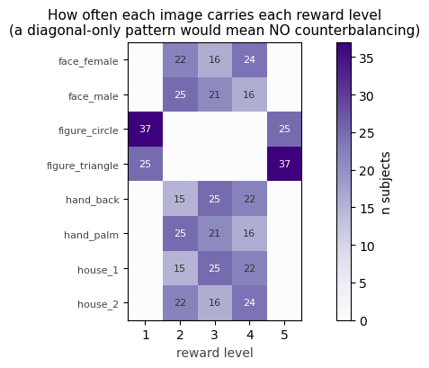

- 12 distinct value assignments across 62 subjects — value dissociated from any fixed image pair
- **Caveat**: values {1, 5} always on `figure` category → non-figure 6-stimulus subset is the primary readout

<!-- SOURCE: multivariate/rsa_design_checks.ipynb §2-5; session-notes/2026-08-26. -->

---

## RSA methodology

1. **Crossnobis distances** — for each pair of the 8 stimuli, compute the cross-validated Mahalanobis distance between their GLMsingle beta patterns (unbiased: expected value = 0 under the null)
2. **Model RDMs** — build 5 predictor dissimilarity matrices from stimulus properties: |Δcategory|, |Δvalue|, |Δfrequency|, |Δsecond_stim_value|, |Δchoice_rate|
3. **Multiple regression** — per subject, per ROI:

   *d*neural(*i,j*) = β₁·|Δcategory| + β₂·|Δvalue| + β₃·|Δfrequency| + β₄·|Δsecond_stim_value| +   β₅·|Δchoice_rate| + ε

4. **Group inference** — one-sample t-tests on subject-level βs against 0, FDR-corrected across all ROI × predictor tests

---

## RSA model RDMs — what the regression fits

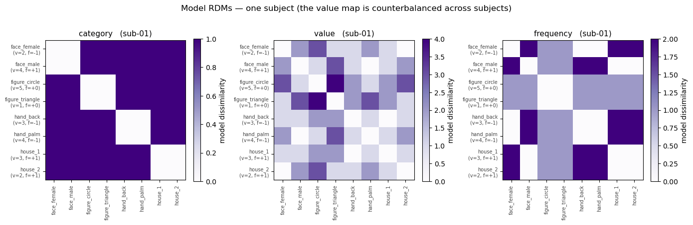

One example subject, 8×8 stimulus dissimilarity predictions (darker = predicted more dissimilar)
- **category**: block structure — 0 within category, 1 across
- **value**: graded by |Δreward level| — counterbalanced value map differs per subject
- **frequency**: graded by |Δchoice frequency label|
- These (+ 2 confound RDMs, not shown) are regressed jointly against each subject's empirical crossnobis RDM per ROI

<!-- SOURCE: multivariate/rsa_roi_results.ipynb §2 (cell 6). -->

---

## RSA results — frequency robust, value weakly negative

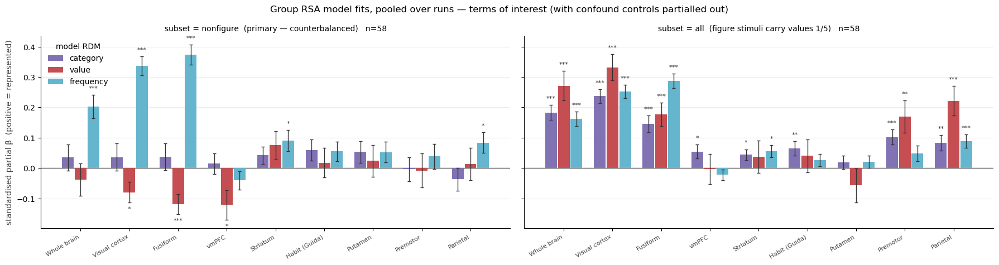

5-term regression, non-figure subset, n=58
- **Frequency**: VC β=+0.337*** · fusiform β=+0.373*** · WB β=+0.203*** — all FDR q<0.001
- **Value**: weakly *negative* — fusiform β=−0.118** (FDR q=0.006), VC −0.080* and vmPFC −0.122* (uncorrected only) · VIF < 5; condition κ median=2.7
- **Why non-figure vs. all differs** (right panel): values {1,5} always sit on `figure`, collinear with |Δcategory| in the full 8-stimulus set — non-figure (left) removes it.

<!-- SOURCE: multivariate/rsa_roi_results.ipynb §3/§3a; session-notes/2026-08-30. -->

---

## RSA confound controls — frequency survives

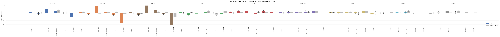

- **Shuffled-label** (pictured): frequency collapses to ~0 under random relabeling — the real effect is genuine
- **Confound terms** (pictured, right-hand bars, same slide-15 model): second_stim_value sig. only in fusiform (β=+0.159, q=0.002); choice_rate opposite-sign in VC (β=−0.120, q=0.047) — neither absorbs frequency
- **Remove-mean** (separate control, not pictured): frequency β survives, even *grows* (VC +0.337→+0.375)

<!-- SOURCE: multivariate/rsa_roi_results.ipynb §3a/§4; session-notes/2026-08-30 findings 1-4. -->

---

## What the frequency effect means

- A positive β(frequency) on neural *distance* means: stimuli with different choice frequencies have **more separable neural patterns** in visual cortex
- **Potential concern:** frequency splits 6 stimuli into two fixed groups of 3 per subject — could this just be identity discrimination between two arbitrary sets?
- **The shuffled-label control rules this out:** random 3-vs-3 splits give β ≈ 0. Only the *real* frequency partition produces larger between-group distances — something about how these stimuli were experienced (chosen often vs. rarely) matters.
- **Counterbalancing adds further protection:** across subjects, different images end up in the high vs. low group (12 assignments), so the group-level effect can't be a fixed visual similarity

<!--
SPEAKER NOTES:
- This is a representational geometry result, not activation level
- Crossnobis distance is unbiased under the null → licenses one-sample t-tests
- The shuffling is the key control: it preserves the 3-vs-3 structure but
  assigns stimuli to groups randomly, so if the effect were just "any 3 vs any 3"
  the shuffled β would be just as large. It's not — it's ~0.
- Counterbalancing addresses between-subject visual confounds;
  shuffling addresses within-subject identity confounds
-->

---

## Value × frequency interaction — two real effects cancelling

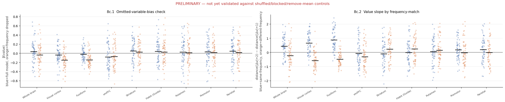

**|Δv|** = absolute reward-level difference between two stimuli (1–5 scale). The **value slope** = neural distance for |Δv|=2 pairs minus |Δv|=1 pairs — steeper slope means bigger reward differences drive more distinct patterns. Split by whether the pair shares the same choice-frequency label (non-figure pairs, n=58):
- **Same-frequency** (blue): VC +0.651***, fusiform +0.869*** — value predicts *more* distance
- **Diff-frequency** (orange): VC −0.579***, fusiform −0.488*** — value predicts *less* distance
- **Interaction** (same − diff): VC +1.230***, fusiform +1.357***

<!-- SOURCE: multivariate/rsa_roi_results.ipynb §8c (single-panel value-slope figure, VC/fusiform highlighted); session-notes/2026-08-27, 2026-08-30. -->

---

## Interaction validated against all controls

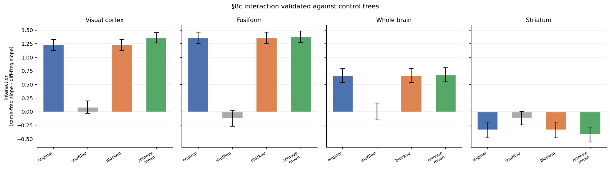

- **Shuffled**: collapses to ~0 (VC orig=+1.23 vs shuf=+0.08, paired-t p<0.0001)
- **Blocked**: reproduces identically (expected — blocked only changes fold splitting)
- **Remove-mean**: slightly strengthens (fusiform +1.36 → +1.38)
- The interaction is genuine — not an artifact of amplitude, fold structure, or grand mean

<!-- SOURCE: multivariate/rsa_roi_results.ipynb §8c-validation; session-notes/2026-08-30 finding 6. -->

---

## What the interaction means?

The joint-model value effect is small and **significantly negative** (fusiform β=−0.118, p=0.0007; visual cortex β=−0.080, p=0.023) — not the naively-expected positive "similar value → similar pattern," and not zero either. It means two real effects of unequal size combine:

- **Within a frequency group** (both high-choice or both low-choice): value *differentiates* — higher Δvalue → more distinct patterns. The brain tells apart stimuli that share a habit level but differ in reward.
- **Across frequency groups** (one high, one low): value *compresses* — higher Δvalue → more similar patterns. The frequency-driven representation change overrides or inverts the value signal.
- There are more different-frequency pairs per subject (9) than same-frequency pairs (6), so the joint (non-partitioned) regression is numerically dominated by the compressing effect — that's why the net is negative rather than zero.

<!--
SPEAKER NOTES:
- Analogy: think of frequency as creating two "clusters" in representation space.
  Within each cluster, value spreads stimuli apart. But the between-cluster axis
  dominates, and value differences across clusters don't add further separation —
  they slightly reduce it.
- The joint model's small negative β(value) is the weighted combination of the
  positive within-group slope and the negative between-group slope, weighted by
  each group's pair count (6 vs 9) — not a simple average to zero.
- The interaction (+1.36) is large, validated, and can't be an artifact of
  amplitude, CV structure, or grand mean.
- 2026-09-03 update: the pooled negative value effect is itself driven by
  learning1/learning2 (fusiform -0.17***/-0.19***) and disappears in `test`
  (+0.12, ns, fusiform) — see rsa_roi_results.ipynb §5 (per-run dynamics
  cells) and session-notes/2026-09-03_rsa-searchlight-cluster-fwe-and-roi-method.md.
-->

---

## Interim summary — RSA

- **Frequency (habit) is the dominant signal** — repeated choice reshapes visual representations, making high- and low-frequency stimuli more separable
- **Value seems to be coded, in a context-dependent manner** — it differentiates within a frequency group but compresses across groups, cancelling to ≈ 0 when pooled
- **Convergent evidence needed** — does an independent method also find frequency coding?

---

## Frequency decoding — ROI classification

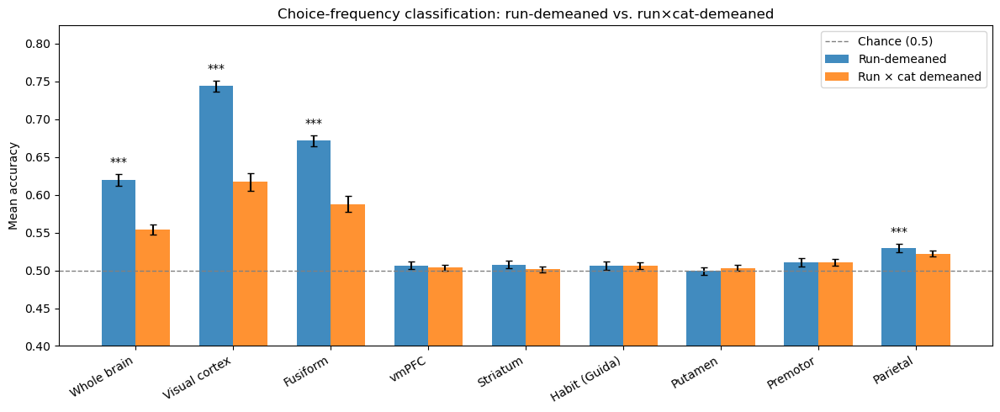

LinearSVC, binary ±1 frequency label, LOGO-CV, n=58, chance=50%
- **Visual cortex: 74.4%**, fusiform: 67.2%, parietal: 52.9% — all FDR q<0.001
- Whole brain: 62.0% (t=14.9); subcortical ROIs all at chance
- Run×category demeaning drops VC ~13% but stays well above chance (61.7%) — not a category artifact

<!-- SOURCE: multivariate/frequency_decoding_results.ipynb §2; session-notes/2026-08-31. -->

<!--
SPEAKER NOTES:
- Decoding is inherently more vulnerable to the 3-vs-3 identity concern than RSA:
  the classifier could succeed by learning identity features of {A,B,C} vs {D,E,F}
  without encoding anything about choice frequency per se
- The RSA shuffled-label control is what makes the overall case: it shows that
  the *real* frequency partition is special compared to arbitrary 3-vs-3 splits
- Counterbalancing across 12 stimulus assignments protects the group-level result
- The high spatial correlation with category searchlight (r=0.868) is expected:
  frequency groups are subsets of stimulus identities, so the same identity-coding
  regions carry both signals. This doesn't invalidate the result given RSA controls.
-->

---

## Frequency searchlight — voxel-level localization

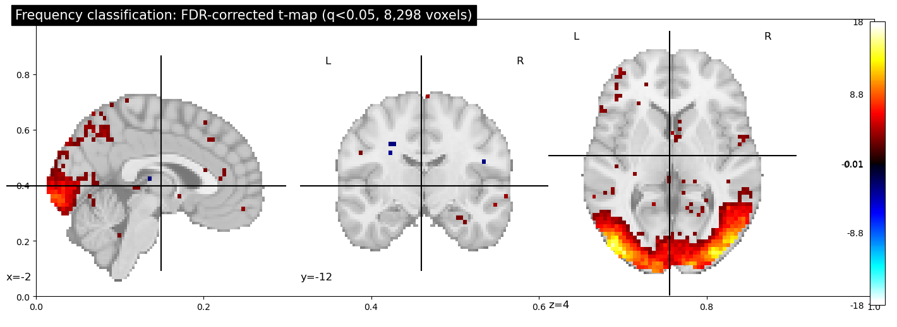

8,245 voxels decode frequency above chance (FDR q<0.05) — 16% of brain
- Peak t=17.6 in right fusiform (42, −57, −15); one large occipitotemporal cluster (232k mm³)
- Parietal and premotor clusters survive FDR — **new** (not significant in ROI RSA)
- **Spatial correlation with category searchlight r=0.868**: the decoded might just be using stimulus identity information

<!-- SOURCE: multivariate/frequency_searchlight_results.ipynb §3-§4; session-notes/2026-08-31. -->

<!-- HIDDEN SLIDE — "Three methods converge on frequency" — removed from the deck flow
   at the user's request (2026-09-01); content kept here to restore easily later.

## Three methods converge on frequency

 

| ROI | RSA β(freq) | Decoding | Searchlight |
|---|---|---|---|
| **Visual cortex** | +0.337*** | **74.4%***  | 53.8%*** |
| **Fusiform** | +0.373*** | **67.2%***  | 58.1%*** |
| **Parietal** | +0.083 | 52.9%*** | 50.7%*** |
| Premotor | +0.038 | n/a | 50.3%** |
| vmPFC | −0.036 | 50.7% | 50.5%* |
| Striatum | +0.091 | 50.8% | 50.5%* |
| Putamen | −0.016 | 49.9% | 50.1% |

\* FDR q<0.05, \*\* q<0.01, \*\*\* q<0.001. RSA: 5-term regression; decoding: one-sample t vs chance; searchlight: FDR across ROIs.
- Fusiform/VC converge across all three methods; parietal/premotor emerge only in decoding + searchlight
- Subcortical ROIs consistently null **at this — ROI-averaged — resolution; see the RSA searchlight below for a voxel-level re-test**

SOURCE: rsa_roi_results.ipynb §3a, frequency_decoding_results.ipynb §2, frequency_searchlight_results.ipynb §5.

SPEAKER NOTES:
- Convergence across methods strengthens the claim, but the methods are not
  equally informative about the 3-vs-3 identity concern:
  • RSA with shuffled labels directly tests whether the real frequency partition
    is special → it is (shuffled β ≈ 0)
  • Decoding/searchlight confirm the information is accessible but can't
    distinguish "frequency coding" from "identity discrimination of two groups"
    on their own
- The RSA controls carry the interpretive weight; decoding/searchlight confirm
  where the signal lives and that it generalises across runs
- Parietal/premotor appearing only in decoding+searchlight, not RSA, likely
  reflects a sensitivity difference (local searchlight vs whole-ROI averaging)
  rather than a qualitative difference — frequency is binary, so there is no
  graded-vs-categorical distinction to make
-->

---

## RSA searchlight — extending the regression to every voxel

- Same 5-term regression as the ROI-level RSA (category, value, frequency, second_stim_value, choice_rate), run in a 6mm-radius sphere around every voxel, n=58
- Plus the value×frequency **interaction**, computed as a same-vs-different-frequency slope difference (not a 6th joint regressor — that version was severely collinear with frequency)
- Tests whether ROI averaging was hiding localized signal, especially in vmPFC/striatum, and whether frequency/interaction extend beyond the fusiform/VC territory already seen

<!-- SOURCE: multivariate/rsa_searchlight_results.ipynb; session-notes/2026-08-31_rsa-searchlight-and-interaction.md finding 5 (collinearity bug + fix). -->

---

## RSA searchlight — only frequency survives FDR as a main effect

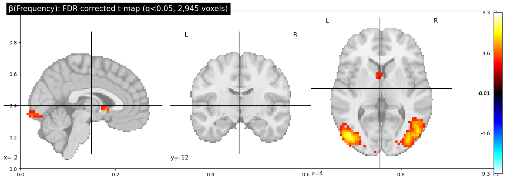

FDR q<0.05 across 51,733 in-brain voxels, n=58:
- **Frequency: 2,945 voxels** (1.8% of brain, +2,926/−19) — two bilateral occipitotemporal clusters, peak t=9.3 at (−48,−81,−1)
- **Value: 0 FDR-sig voxels. Category: 0 FDR-sig voxels** — consistent with the ROI-level joint-model null
- Confound terms (second_stim_value, choice_rate): negligible (≤4 isolated voxels)

<!-- SOURCE: multivariate/rsa_searchlight_results.ipynb §3-4, findings summary #1-2; session-notes/2026-08-31_rsa-searchlight-and-interaction.md finding 1. -->

---

## RSA searchlight — striatum newly significant

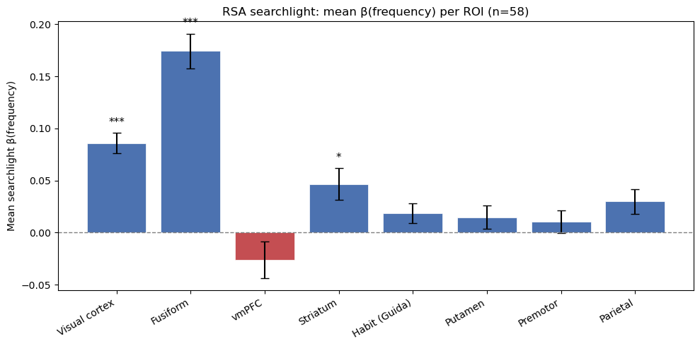

ROI mean β(frequency), FDR across 40 term×ROI tests:
- Fusiform **+0.174\*\*\***, visual cortex **+0.086\*\*\*** — confirms ROI-level RSA
- **Striatum +0.047\*** — **NEW**: null at the ROI level (β=+0.091, n.s.), significant here
- Parietal trending (+0.030, uncorrected p=0.018, FDR q=0.091); vmPFC/habit/putamen/premotor n.s.
- **What this is**: the *mean of the per-voxel searchlight β* across the ROI, tested across subjects — not purely an ROI-averaging artifact: 17/128 striatum voxels (left ventral striatum, MNI≈−5,8,−1) individually clear whole-brain FDR too (one contiguous cluster, mean t=4.14), and the rest trend positive (80.5% of the ROI, mean t=1.05) — both the small real cluster and the diffuse tendency contribute to the ROI-mean result

<!-- SOURCE: multivariate/rsa_searchlight_results.ipynb §5, findings summary #3, #7; session-notes/2026-08-31_rsa-searchlight-and-interaction.md finding 2. -->

---

## RSA searchlight vs. frequency-decoding searchlight

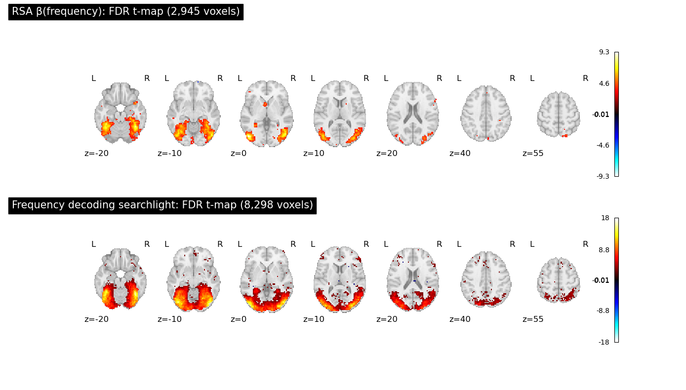

Voxelwise spatial correlation of t-maps (51,733 voxels): **r = 0.733**
- Same peak regions in both — converges with the decoding searchlight's occipitotemporal cluster
- RSA is the more conservative test: 2,945 vs. 8,245 FDR voxels, because it partials out category, value, and the confound RDMs in the same regression — the decoding searchlight classifies raw patterns with no such control
- Two independent whole-brain methods now agree on where frequency is represented

<!-- SOURCE: multivariate/rsa_searchlight_results.ipynb §6, findings summary #5. -->

---

## RSA searchlight — the value×frequency interaction, voxelwise

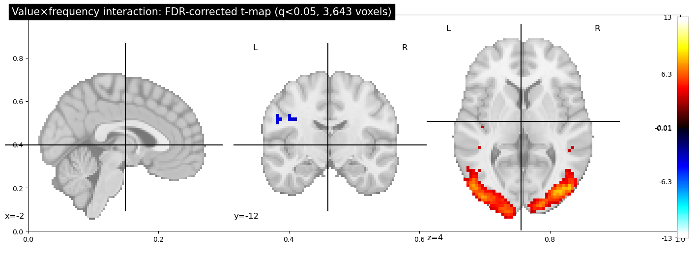

FDR q<0.05: **3,643 voxels** (2.2% of brain, +3,596/−47) — stronger than the frequency main effect alone (peak t=12.5 vs. 9.3)
- Two large bilateral occipitotemporal clusters (54.9k / 53.9k mm³), same territory as the frequency map
- ROI means reproduce the ROI-level RSA exactly: **fusiform +0.647\*\*\***, **VC +0.314\*\*\*** (cf. `rsa_roi_results.ipynb` §8c: fusiform +1.357\*\*\*, VC +1.230\*\*\* — different scale, same qualitative pattern; ROI vs. sphere size)
- Striatum trends **negative** (uncorrected p=0.064) — opposite sign to fusiform/VC, not significant, worth watching

<!-- SOURCE: multivariate/rsa_searchlight_results.ipynb §9, findings summary #8-9; session-notes/2026-08-31_rsa-searchlight-and-interaction.md findings 3, open thread 3. -->

---

## Interim summary — RSA searchlight

- **The ROI-level story replicates voxelwise**: frequency (not value or category) is the only main effect that survives FDR whole-brain, concentrated in fusiform/VC
- **New**: striatum carries a small but FDR-significant frequency signal invisible to whole-ROI averaging — decision-relevant territory beyond visual cortex
- **The interaction is not an artifact of the ROI averaging or the crossnobis pooling** — it reproduces voxelwise, in the same territory, with a *larger* effect than the frequency main effect alone
- Converges with the independent frequency-decoding searchlight (r=0.733, same peaks) — three whole-brain methods (RSA, decoding, searchlight) now agree

---

## Bottom line

- **Category decoding is robust and validated** — survives label-shuffle, CV-scheme, and per-run checks
- **Reward-value decoding is blocked** by a deterministic identity confound — not solvable by demeaning in this design
- **Frequency (the habit manipulation) is the dominant multivariate signal** — robust across RSA, decoding, and searchlight (ROI *and* voxelwise); concentrated in fusiform/VC with new parietal/premotor/striatum involvement
- **Value coding appears context-dependent** — positive within same-frequency pairs, negative across; reproduces voxelwise, validated against controls

---

## Open items

1. **Frontal/orbitofrontal/IFG searchlight clusters** — present in both the frequency and interaction RSA searchlight maps; anatomical labeling and interpretation still needed
2. **Striatum interaction trend** (uncorrected p=0.064, opposite sign to fusiform/VC) — not significant, worth a targeted follow-up with more power
3. **RSA–decoding subject-level convergence** — do the same subjects show strong effects in both?
4. **FDR-correct the interaction** — currently tested per-ROI, not across the full ROI table
5. **Interpret VC choice_rate negative effect** — significant but opposite-sign; what does it mean?

*Parked:* value_diff target decoding, RL Q-value RSA variant, reward FREM, merge rsa-roi → main

---

# Questions?
